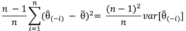

# Лабораторная работа 5 
## Задачи для лабораторной: 
* использование функций для автоматизации рутинных задач;
* декомпозиция функций;
* количественная оценка неопределённости

## Требования к оформлению
* Оформить решение в R Markdown. 
* Сохранить файл в свой репозиторий.
* Выгрузить R Markdown в HTML, назвать своим именем и отправить по почте (если хочется сдать раньше или нужна помощь).

## Исходные данные
&ensp;В прошлой лабораторной был рассмотрен алгоритм подгонки гамма-распределения под данные о весе кошачьих сердец.
Несложно заметить, что при повторе измерения для другой выборки кошек из того же набора данных, значения
расчётных параметров будут отличаться. Насколько мы можем быть уверены в полученных значениях, подверженных влиянию шума выборки?  
&ensp;Существует несколько способов количественной оценки неопределённости, используя некоторое количество знаний теории вероятности.
В этой лабораторной рассмотрим численный способ оценки стандартных ошибок (standard errors, SE), который называется
складной нож (jackknife). 
Метод не сложный, но не всегда достаточно точный.  
 &ensp;Вот как он работает:

1. Для набора из n значений получите оценку θ^ интересующего вас параметра θ.
2. Для i-го значения, удалите это значение из набора данных и получите оценку θ^(-i) 
для оставшихся n - 1 значений
3. Найдите мат. ожидание (mean) ̄θ¯  для n полученных оценок θ^(-i)
4. Дисперсия методом складного ножа для θ^, определятся как:  
  
, где ``var`` дисперсия выборки.
5. Стандартная ошибка (jackknife SE) равняется квадратному корню от дисперсии (jackknife variance).

### Задание
1. В папке с этим заданием в файле _lab5.R_ находится определение функции
_gamma.estimate_, которую вы должны были написать в прошлой лабораторной (_my.gamma_).
2. Возьмите данные четырёх первых кошек из набора данных. Используя функцию _gamma.estimate_,
получите оценки _s_ и _a_ для каждой кошки из выбранных. Получите стандартную ошибку методом перочинного ножа
для _a_ и для _s_. Не нужно писать для этого функции, просто вызовите нужное кол-во раз функцию, сохраните
результаты в переменные или вектор и рассчитайте дисперсию.
3. Напишите функцию _my.gamma.jk()_, принимающую вектор и возвращающую стандартные ошибки для _a_ и _b_.
Функция должна вызывать _gamma.estimate_. Допустимо использовать циклы.
4. Вызовите написанную функцию для данных из п.2. Сходятся ли полученные значения?
5. Вызовите написанную функцию для получения стандартных ошибок _a_ и _s_ для полного набора данных.
6. Рассчитайте параметры _a_ и _s_ раздельно для кошек и котов. Найдите jackknife SE для полученных параметров (всего 4).
7. Стандартная ошибка разницы между двумя независимыми количественными оценками d1 и d2 равняется:  
``sqrt(se1^2 + se2^2)``, где se1 и se2 стандартные отклонения для d1 и d2 соответственно.
Рассчитайте разницу оцениваемых параметров между кошками и котами и стандартное отклонение разницы.
8. Означают ли полученные из предыдущего пункта значения, что наблюдается значимое влияние пола на вес сердца?
Поясните ответ.
